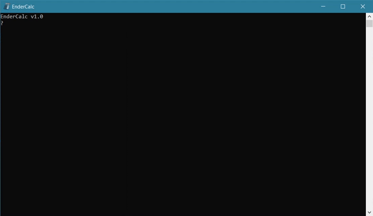

# EnderCalc

### A powerful, text-driven scientific calculator

*'Cause sometimes the Windows Calculator just isn't good enough*

EnderCalc is a fast, powerful, arbitrary precision, text-driven scientific calculator written in (almost) pure C99. It supports basic arithmetic, logarithms and roots, trigonometric functions, hyperbolic functions, statistics functions, and much more (a full reference is available in [reference.pdf](reference.pdf)).

## Download

Please see the releases section for Windows x64 binaries.

I am not able to build for other platforms at this point but would be happy to accept contributions from someone who can—please consult [build.cmd](build.cmd) for direction. You'll also need to provide another library implementing functions used from readline; I believe [libedit](https://thrysoee.dk/editline/) would serve this purpose for Unix-like operating systems.

## Documentation

Please see [reference.pdf](reference.pdf), shipped with EnderCalc, for user-facing documentation.

For a whirlwind introduction to how EnderCalc works internally, have a look at [DEVDOCS.md](DEVDOCS.md).

## License

[GNU General Public License, version 3](https://choosealicense.com/licenses/gpl-3.0/)

## Open Source Libraries

- [libbf](https://bellard.org/libbf/) 20200119 by [Fabrice Bellard](https://bellard.org)
- [WinEditLine](http://mingweditline.sourceforge.net/) 2.206 by Paolo Tosco
- [minIni](https://www.compuphase.com/minini.htm) 1.2b by Thiadmer Riemersma